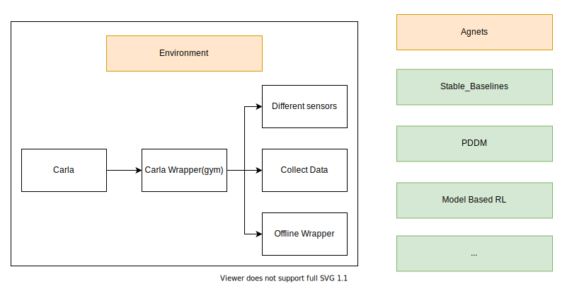

# Carla Gym Wrapper

## CARLA Setup
1. Add the following environment variables:  
```
export PYTHONPATH=$PYTHONPATH:/opt/carla-simulator/PythonAPI
export PYTHONPATH=$PYTHONPATH:/opt/carla-simulator/PythonAPI/carla/
export PYTHONPATH=$PYTHONPATH:/opt/carla-simulator/PythonAPI/carla/dist/carla-0.9.9-py3.7-linux-x86_64.egg
```
2. Install the following extra libraries  
```
pip install pygame
pip install networkx
pip install dotmap
pip install gym
```

3. Open a new terminal session, and run the CARLA simulator:  
```
bash CarlaUE4.sh -fps 20
```

4. In a second terminal window, run   
```
python carla_env_test.py
```

## Data collection
How to wrap the environment with the data collection wrapper:
```
env = gym.make('CarlaEnv-pixel-v1')
env = DataCollector(env, 200, './output')
```

Load existing dataset:
```
env = DataCollector(env, 200, './output', load_dir='./output/dataset_200.pkl')
```

Example script:
```
python collect_data_test.py
```

## CARLA Wrapper Architecture 

